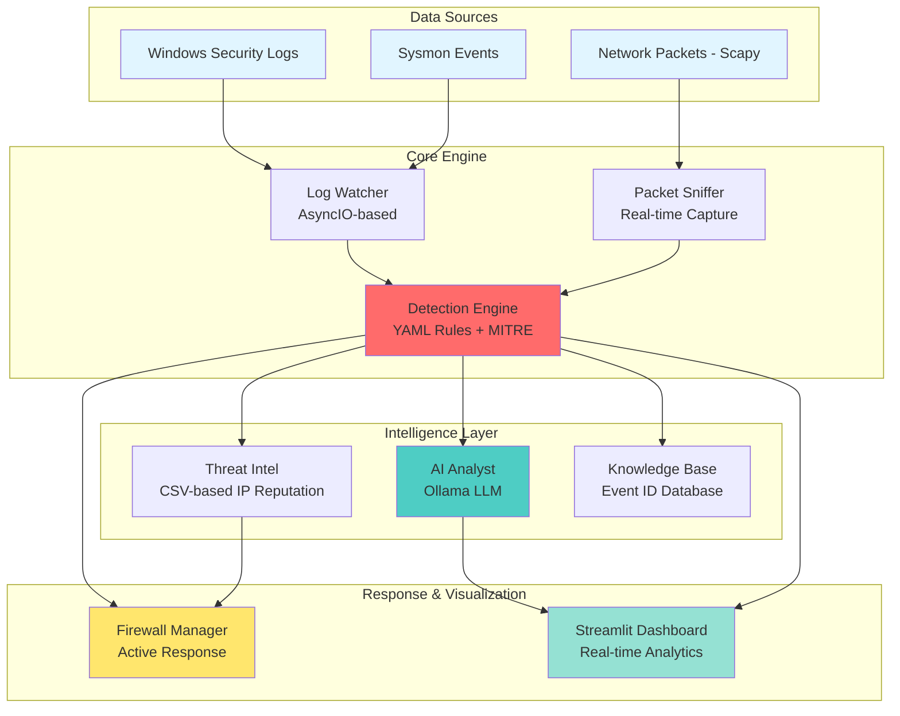

# 🛡️ LocalShield - Next-Gen Offline SIEM & Network Monitor

[](https://www.python.org/)
[](https://streamlit.io/)
[](https://scapy.net/)
[](https://ollama.ai/)
[](https://attack.mitre.org/)
[](https://docs.python.org/3/library/asyncio.html)
[](LICENSE)

> **A privacy-focused, offline cybersecurity platform that combines Windows security logs and live network traffic analysis with local AI-powered threat detection and automated response capabilities.**

---

## 📋 TL;DR

**LocalShield** is an enterprise-grade Security Information and Event Management (SIEM) system that runs entirely offline on Windows. It integrates:

- **Windows Event Log Analysis** (Security + Sysmon) with real-time monitoring
- **Live Network Packet Capture** (Wireshark-like functionality) using Scapy
- **AI-Powered Threat Analysis** via local LLM (Ollama) - no cloud dependencies
- **YAML-Based Detection Rules** with MITRE ATT&CK framework integration
- **Automated Response (SOAR)** through Windows Firewall integration
- **Professional Dashboard** built with Streamlit for real-time visualization

**Perfect for:** Security researchers, SOC analysts, penetration testers, and cybersecurity professionals who need a powerful, privacy-respecting security monitoring solution.

---

## 🏗️ Architecture



### System Flow

1. **Data Collection**: Windows Event Logs (Security/Sysmon) and network packets are captured in real-time
2. **Detection Engine**: YAML-based rules check events against MITRE ATT&CK techniques
3. **AI Analysis**: Local LLM (Ollama) provides contextual threat analysis without cloud dependency
4. **Threat Intelligence**: CSV-based IP reputation database for known malicious IPs
5. **Active Response**: High-risk IPs are automatically blocked via Windows Firewall
6. **Visualization**: Streamlit dashboard provides real-time monitoring and analytics

---

## 🔥 Key Features

### 🧠 Hybrid Intelligence System

- **Signature-Based Detection**: Fast, rule-based detection using YAML configuration files
- **Behavioral Analysis**: AI-powered anomaly detection using local LLM (Ollama)
- **MITRE ATT&CK Integration**: All detections mapped to MITRE ATT&CK framework techniques
- **Knowledge Base (RAG)**: Event ID explanations and security protocols retrieved from local database

### 🌐 Real-Time Network Monitoring

- **Live Packet Capture**: Wireshark-like functionality using Scapy
- **Protocol Analysis**: TCP, UDP, ICMP traffic analysis with protocol distribution charts
- **IP Reputation**: Automatic detection of traffic from known malicious IP ranges
- **PCAP Export**: Capture network traffic to `.pcap` files for forensic analysis
- **Traffic Statistics**: Top source/destination IPs, port analysis, and protocol breakdown

### 🛡️ Automated Response (SOAR)

- **Active Defense**: Automatic Windows Firewall blocking of high-risk IP addresses
- **Risk-Based Actions**: Configurable response thresholds (High/Critical events)
- **IP Extraction**: Intelligent IP address extraction from log messages and network traffic
- **Private IP Filtering**: Automatic exclusion of internal network IPs from blocking

### 📊 Professional Security Dashboard

- **Real-Time Log Analysis**: Live event monitoring with risk level visualization
- **Network Traffic Monitor**: Interactive packet capture interface with live charts
- **AI Security Assistant**: Chat-based interface for security queries and analysis
- **Vulnerability Scanner**: Open port detection with risk assessment
- **MITRE Technique Mapping**: Visual representation of detected attack techniques
- **Export Capabilities**: CSV export for log analysis and reporting

### 🕵️‍♂️ Advanced Detection Rules

- **YAML-Based Configuration**: Easy-to-write detection rules with flexible conditions
- **Regex Pattern Matching**: Support for complex pattern matching in log messages
- **Threshold-Based Alerts**: Time-window and count-based detection (e.g., brute force)
- **Parent-Child Process Detection**: Identify suspicious process relationships
- **Multi-Event Correlation**: Track events across time windows for advanced threat detection

### 🔒 Privacy & Security

- **100% Offline**: No cloud dependencies, all processing happens locally
- **No Data Leakage**: Logs and network data never leave your machine
- **Local AI**: Uses Ollama for AI analysis - no API keys or external services required
- **Encrypted Storage**: SQLite database with WAL mode for secure data persistence

---

## 📸 Screenshots

### Dashboard Overview (Threat Analysis)
*[Screenshot: Dashboard showing high-risk events, MITRE techniques, and AI analysis]*

### Network Traffic Monitor (Live Sniffing)
*[Screenshot: Real-time packet capture interface with protocol distribution charts]*

### AI Security Analyst (Interactive Chat)
*[Screenshot: Chat interface with AI assistant providing security recommendations]*

### Vulnerability Scan (Open Ports)
*[Screenshot: Port scanner showing high-risk open ports with detailed information]*

---

## 🚀 Installation & Usage

### Prerequisites

- **Windows 10/11** (Administrator privileges required)
- **Python 3.10+**
- **Npcap** ([Download here](https://npcap.com/)) - Required for packet capture on Windows
- **Ollama** ([Download here](https://ollama.ai/)) - Required for AI analysis

### Step 1: Clone the Repository

```bash
git clone https://github.com/yourusername/LocalShield.git
cd LocalShield
```

### Step 2: Install Dependencies

```bash
# Create virtual environment (recommended)
python -m venv venv
venv\Scripts\activate  # On Windows

# Install requirements
pip install -r requirements.txt
```

### Step 3: Install Npcap (Windows)

1. Download Npcap from [https://npcap.com/](https://npcap.com/)
2. Install with default settings
3. **Important**: Run as Administrator when using packet capture features

### Step 4: Setup Ollama (AI Analysis)

1. Download and install Ollama from [https://ollama.ai/](https://ollama.ai/)
2. Pull a compatible model (recommended: `gemma3:4b` or `llama3:8b`):
   ```bash
   ollama pull gemma3:4b
   ```
3. Update `config.py` or set environment variable:
   ```bash
   set OLLAMA_MODEL_NAME=gemma3:4b
   ```

### Step 5: Generate Demo Data (Optional)

To see the system in action with sample attack data:

```bash
python generate_demo_data.py
```

This will populate the database with realistic security events including:
- APT29-style PowerShell attacks
- Brute force attempts from known threat actor IPs
- Privilege escalation attempts
- Normal system activity

### Step 6: Launch LocalShield

**Option A: Using the launcher script (Recommended)**
```bash
run_localshield.bat
```

This script will:
- Activate virtual environment
- Start Log Watcher in background (requires Admin)
- Launch Streamlit Dashboard

**Option B: Manual start**
```bash
# Terminal 1: Start Log Watcher (as Administrator)
python log_watcher.py

# Terminal 2: Start Dashboard
streamlit run dashboard.py
```

The dashboard will be available at: `http://localhost:8501`

---

## 🛠️ Tech Stack

### Core Technologies

- **Python 3.10+**: Modern Python with type hints and async/await support
- **Streamlit**: Interactive web dashboard framework
- **Scapy**: Network packet manipulation and capture
- **SQLite**: Lightweight, embedded database with WAL mode
- **Ollama**: Local LLM inference engine
- **Pandas**: Data manipulation and analysis
- **PyYAML**: YAML-based rule configuration
- **Altair**: Statistical visualization library

### Windows Integration

- **pywin32**: Windows API access for Event Log reading
- **psutil**: System and process utilities
- **Windows Firewall API**: Automated IP blocking

### Architecture Patterns

- **AsyncIO**: Non-blocking I/O for real-time log monitoring
- **Thread Pool Executor**: Background processing for blocking operations
- **Session State Management**: Streamlit state persistence
- **RAG (Retrieval-Augmented Generation)**: Hybrid AI with knowledge base

---

## 📁 Project Structure

```
LocalShield/
├── dashboard.py              # Streamlit dashboard application
├── log_watcher.py            # Main log monitoring service (AsyncIO)
├── db_manager.py             # Database operations and management
├── config.py                 # Configuration and environment variables
├── generate_demo_data.py     # Demo data generator for testing
├── run_localshield.bat       # Windows launcher script
│
├── modules/
│   ├── detection_engine.py  # YAML-based rule engine with MITRE mapping
│   ├── ai_engine.py         # Ollama LLM integration for threat analysis
│   ├── packet_capture.py    # Real-time network packet sniffer (Scapy)
│   ├── network_scanner.py    # Open port vulnerability scanner
│   ├── response_engine.py    # Windows Firewall automation (SOAR)
│   ├── threat_intel.py      # IP reputation and threat intelligence
│   ├── chat_manager.py      # AI assistant chat interface
│   └── knowledge_base.py    # Event ID database (RAG)
│
├── rules/                    # YAML detection rules
│   ├── brute_force.yaml
│   ├── powershell_encoded.yaml
│   └── parent_child_suspicious.yaml
│
├── tests/                    # Unit and integration tests
│   ├── test_detection_engine.py
│   └── test_new_rules.py
│
├── data/                     # Knowledge base and threat intel data
└── requirements.txt          # Python dependencies
```

---

## 🔧 Configuration

### Environment Variables

Create a `.env` file in the project root (optional):

```env
# Ollama Model
OLLAMA_MODEL_NAME=gemma3:4b

# Database
DB_PATH=logs.db

# Event Logs
EVENT_LOG_NAME=Security
SYSMON_LOG_NAME=Microsoft-Windows-Sysmon/Operational

# Dashboard
DASHBOARD_PORT=8501

# Log Watcher
CHECK_INTERVAL=5

# Demo Mode (for screenshots/testing)
DEMO_MODE=False
```

### Detection Rules

Customize detection rules in `rules/*.yaml`:

```yaml
id: "custom_rule_001"
name: "Custom Detection Rule"
description: "Detects specific attack pattern"
mitre:
  - "T1059.001"
severity: "high"
tags:
  - "execution"
  - "powershell"
enabled: true

conditions:
  event_id: "1"
  provider: "Sysmon"
  command_line_regex: "-EncodedCommand"
  threshold: 1
```

---

## 🧪 Testing

Run the test suite:

```bash
# Run all tests
pytest

# Run specific test file
pytest tests/test_new_rules.py -v

# Test packet capture
python test_sniffer.py
```

---

## 📊 Use Cases

### 1. Security Operations Center (SOC)

- Real-time monitoring of Windows security events
- Automated threat detection and response
- MITRE ATT&CK technique mapping for threat hunting
- AI-powered incident triage and analysis

### 2. Penetration Testing

- Network traffic analysis during security assessments
- Detection rule validation and testing
- Attack simulation with `generate_demo_data.py`
- Vulnerability assessment with port scanning

### 3. Security Research

- Offline analysis of security logs
- Custom detection rule development
- Threat intelligence research
- Security tool development and testing

### 4. Educational & Training

- Cybersecurity education and training
- SIEM/SOAR concept demonstration
- MITRE ATT&CK framework learning
- Security monitoring best practices

---

## 🤝 Contributing

Contributions are welcome! Please feel free to submit a Pull Request.

1. Fork the repository
2. Create your feature branch (`git checkout -b feature/AmazingFeature`)
3. Commit your changes (`git commit -m 'Add some AmazingFeature'`)
4. Push to the branch (`git push origin feature/AmazingFeature`)
5. Open a Pull Request

---

## 📝 License

This project is licensed under the MIT License - see the [LICENSE](LICENSE) file for details.

---

## ⚠️ Disclaimer

**This project is for educational and portfolio purposes.**

- Use at your own risk in production environments
- Always test thoroughly before deploying
- Ensure proper security measures are in place
- Review and customize detection rules for your environment
- This tool is not a replacement for enterprise-grade SIEM solutions

**The author is not responsible for any misuse or damage caused by this software.**

---

## 🙏 Acknowledgments

- **MITRE ATT&CK Framework** for threat classification
- **Ollama** for providing local LLM capabilities
- **Scapy** for network packet manipulation
- **Streamlit** for the excellent dashboard framework
- **Windows Security Community** for event log documentation

---

## 📧 Contact & Support

For questions, issues, or contributions:

- **GitHub Issues**: [Open an issue](https://github.com/yourusername/LocalShield/issues)
- **Documentation**: See inline code comments and docstrings

---

**Built with ❤️ for the cybersecurity community**

*Last updated: December 2024*
