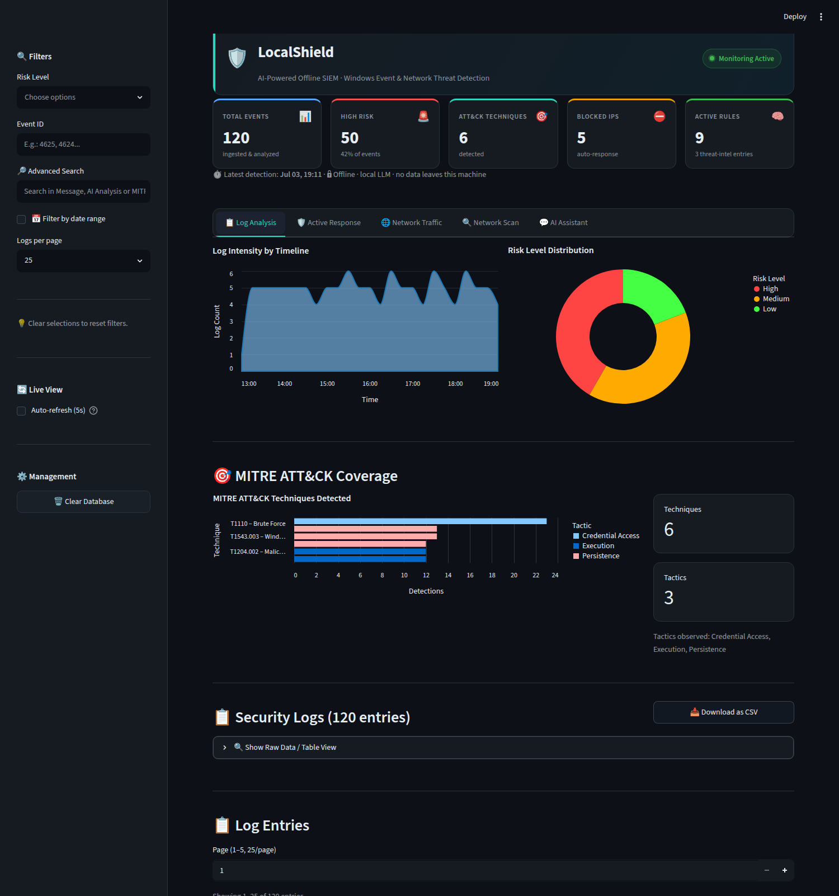
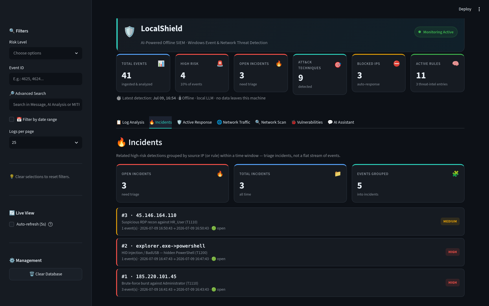
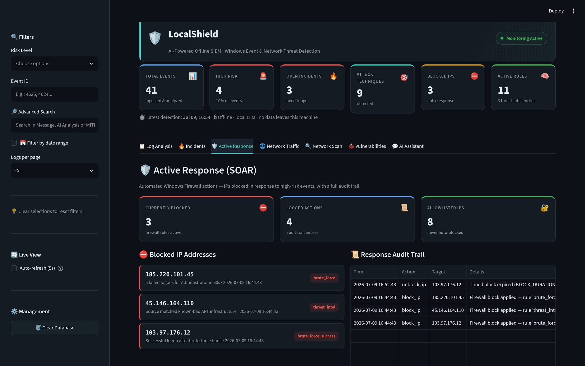
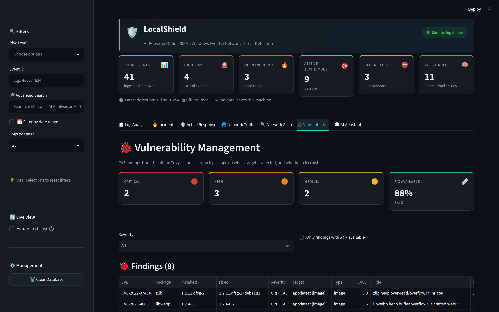

# 🛡️ LocalShield - Offline SIEM & Network Monitor

[](https://github.com/saglamh35/LocalShield/actions/workflows/ci.yml)
[](https://www.python.org/)
[](https://streamlit.io/)
[](https://scapy.net/)
[](https://ollama.ai/)
[](https://attack.mitre.org/)
[](https://docs.python.org/3/library/asyncio.html)
[](LICENSE)

> **A privacy-focused, offline cybersecurity platform that combines Windows security logs and live network traffic analysis with local AI-powered threat detection and automated response capabilities.**

---

## 📋 TL;DR

**LocalShield** is an educational prototype Security Information and Event Management (SIEM) system that runs entirely offline on Windows. It integrates:

- **Windows Event Log Analysis** (Security + Sysmon) with real-time monitoring
- **Live Network Packet Capture** (Wireshark-like functionality) using Scapy
- **AI-Powered Threat Analysis** via local LLM (Ollama) - no cloud dependencies
- **YAML-Based Detection Rules** with MITRE ATT&CK framework integration
- **Automated Response (SOAR)** through Windows Firewall integration and Ansible remediation
- **Vulnerability Management (CVE)** via offline Trivy scanning of container images and filesystems
- **Observability** with a Prometheus exporter and a ready-to-import Grafana dashboard
- **Professional Dashboard** built with Streamlit for real-time visualization


---

## 🏗️ Architecture


### System Flow

1. **Data Collection**: Windows Event Logs (Security/Sysmon) and network packets are captured in real-time
2. **Detection Engine**: YAML-based rules check events against MITRE ATT&CK techniques
3. **AI Analysis**: Local LLM (Ollama) provides contextual threat analysis without cloud dependency
4. **Threat Intelligence**: CSV-based IP reputation database for known malicious IPs
5. **Active Response**: High-risk IPs are automatically blocked via Windows Firewall
6. **Visualization**: Streamlit dashboard provides real-time monitoring and analytics

---

## 🔥 Key Features

### 🧠 Hybrid Intelligence System

- **Signature-Based Detection**: Fast, rule-based detection using YAML configuration files
- **AI-Assisted Analysis**: Local LLM (Ollama) explains each event in plain language — "what happened, should I worry, what do I do?" — with strict JSON output and a repeat-event cache to avoid redundant model calls
- **MITRE ATT&CK Integration**: Every detection is mapped to MITRE ATT&CK techniques, with an in-dashboard coverage view
- **Knowledge Base (RAG)**: Event ID explanations and response guidance retrieved from a local knowledge base

### 🕵️‍♂️ Detection Engine

- **Curated Rule Set**: Ships with rules for brute force (incl. RDP, Logon Type 10), encoded PowerShell, suspicious parent-child chains, LOLBin downloads (certutil/bitsadmin), new services (7045), new accounts (4720), privileged-group changes (4732), account lockouts (4740), WMIC process creation, audit-log clearing (1102), audit-policy changes (4719) and scheduled-task creation (4698)
- **Multi-Rule Matching**: One event can trip several rules; every match is reported (all MITRE techniques preserved), not just the first
- **Per-Source Correlation**: Threshold rules (e.g. brute force) count **per attacker IP** — IPv4 or IPv6, with equivalent IPv6 spellings sharing one counter — so unrelated failures across hosts don't raise false alerts
- **Flexible Conditions**: Event ID, provider, regex on message / command line / image / parent image, time-window thresholds, and per-source grouping
- **MITRE-Mapped**: Each rule declares its techniques, severity and tags

### 🛡️ Automated Response (SOAR)

- **Active Defense**: Automatic Windows Firewall blocking of high-risk source IPs (IPv4 **and** IPv6)
- **Safe Targeting**: Block candidates are taken only from structured source-address fields and confirmed threat-intel hits — never a blanket scan of message text (prevents block-list poisoning)
- **Critical-IP Allowlist**: DNS/gateway and other critical IPs are never blocked
- **Timed Blocks**: Optional auto-expiry (`BLOCK_DURATION_MINUTES`) lifts each block after a set duration
- **Dry-Run Mode**: `RESPONSE_DRY_RUN=True` exercises every safety check and audit record without touching the firewall
- **Manual Unblock**: Lift any block straight from the dashboard's Active Response tab — audited like every automated action
- **Private-IP Filtering** and a **persisted audit trail** of every automated action

### 🌐 Threat Intelligence & Network Monitoring

- **IP Reputation**: CSV-based feed supporting single IPs and **CIDR ranges**, in both IPv4 and IPv6
- **Opt-In Feed Updater**: `python -m modules.threat_intel --update` merges a public blocklist (default: abuse.ch Feodo Tracker) into the local CSV — manual entries are preserved, and the runtime itself never fetches anything (offline-first stays intact)
- **Live Packet Capture**: Wireshark-like capture using Scapy, with protocol analysis and PCAP export
- **Traffic Statistics**: Top source/destination IPs, port analysis, and protocol breakdown
- **Vulnerability Scanner**: Open-port detection with risk assessment

### 🐞 Vulnerability Management (CVE)

- **Trivy-based CVE scanning** of container images and host filesystems — surfaces *which package on which target is affected* and whether a fix is available
- **Offline-first**: Trivy's DB is downloaded once and then used air-gapped (`--skip-db-update`), like the local Ollama model; the scanner degrades gracefully when Trivy is absent
- **Dedup on `(cve_id, package, target)`**: repeated scans upsert findings instead of multiplying them
- **De-spammed alerting**: one summary notification per scan (Critical/High counts) via the existing `Notifier`, not one alert per CVE
- **Vulnerabilities dashboard tab**: severity KPI row, "% with a fix" metric, and a filterable CVE table
- **Ansible remediation (SOAR)**: generates an Ansible playbook that upgrades the affected packages across the affected hosts. **Dry-run by default** (honors `RESPONSE_DRY_RUN`) — the playbook is rendered and audited for review, never auto-executed; degrades gracefully when `ansible-playbook` is absent

### 📈 Observability (Prometheus & Grafana)

- **Prometheus exporter**: SIEM + vulnerability KPIs (logs, high-risk events, open incidents, blocked IPs, vulnerabilities by severity, fixable ratio) served at `/metrics` — stdlib `http.server` only, **no new dependencies**, localhost-bound by default
- **Grafana dashboard**: a ready-to-import `grafana/localshield_dashboard.json` (stat panels, fixable-ratio gauge, severity time series)
- Run with `python -m modules.metrics_exporter`; see [`docs/OBSERVABILITY.md`](docs/OBSERVABILITY.md) for the Prometheus scrape config and Grafana import steps

### 📊 Security Dashboard

- **Log Analysis**: Risk-level visualization, timeline and risk-distribution charts
- **MITRE ATT&CK Coverage**: Techniques detected, grouped and coloured by tactic
- **Honest Live Status**: The header badge is driven by a watcher heartbeat — Monitoring Active / Watcher Stale / Watcher Offline (a dashboard-only Docker deployment shows Offline by design)
- **Incident Triage**: Close and reopen incidents directly from the Incidents tab
- **Filtering & Pagination**: Risk / Event ID / full-text / date-range filters with paginated log cards
- **Opt-In Live View**: Auto-refresh is a toggle (default off) so reading and the AI chat aren't interrupted
- **AI Security Assistant**: Chat interface grounded in your current logs and open ports
- **Export**: CSV export for reporting

### 🗄️ Data & Persistence

- **SQLite (WAL mode)** with indexes on timestamp and risk score
- **Audit tables**: automated `actions` and persisted `blocked_ips` survive restarts
- **Retention policy**: optional `LOG_RETENTION_DAYS` purge keeps the database from growing unbounded

### 🔒 Privacy & Security Posture

- **100% Offline**: No cloud dependencies; logs and network data never leave your machine
- **Local AI**: Ollama only — no API keys or external services
- **Localhost-Bound Dashboard**: Ships bound to `localhost` (no built-in auth) — expose to a network only behind an authenticating reverse proxy
- **Prompt Hardening**: Log content is treated as untrusted data by the AI

### ✅ Quality

- **280+ unit tests** and **GitHub Actions CI** across Python 3.10 / 3.11 / 3.12
- **Cross-platform detection core**: import Linux SSH `auth.log` and run it through the same rules (see below)

---

## 📸 Screenshots

### Log Analysis — risk scoring &amp; MITRE ATT&CK coverage



### Incidents — related detections grouped for triage



### Active Response (SOAR) — blocked IPs &amp; audit trail



### Vulnerability Management — CVE findings &amp; fix coverage



---

## 🚀 Installation & Usage

### ⚡ Quick Start — pick your path

| Path | Best for | One-liner |
| ---- | -------- | --------- |
| 🐳 **Docker** | Trying it out fast, any OS (Linux/macOS/Windows+WSL) | `docker compose up -d --build` → [details](#-run-with-docker) |
| 🪟 **Windows launcher** | Full features incl. live Event Log capture & firewall response | double-click `run_localshield.bat` |
| 🐧 **Linux/macOS launcher** | Native dashboard + detection core (no Docker) | `./run_localshield.sh` |
| 🔧 **Manual** | Full control over each step | see [detailed steps](#step-1-clone-the-repository) below |

> Docker runs the **cross-platform detection core + dashboard** and bundles Ollama
> for AI. Live Windows Event Log capture and automated firewall blocking are
> Windows-only — use `run_localshield.bat` for those.

### Prerequisites

- **Windows 10/11** (Administrator privileges required)
- **Python 3.10+**
- **Npcap** ([Download here](https://npcap.com/)) - Required for packet capture on Windows
- **Ollama** ([Download here](https://ollama.ai/)) - Required for AI analysis

### Step 1: Clone the Repository

```bash
git clone https://github.com/yourusername/LocalShield.git
cd LocalShield
```

### Step 2: Install Dependencies

```bash
# Create virtual environment (recommended)
python -m venv venv
venv\Scripts\activate  # On Windows

# Install requirements
pip install -r requirements.txt
```

### Step 3: Install Npcap (Windows)

1. Download Npcap from [https://npcap.com/](https://npcap.com/)
2. Install with default settings
3. **Important**: Run as Administrator when using packet capture features

### Step 4: Setup Ollama (AI Analysis)

1. Download and install Ollama from [https://ollama.ai/](https://ollama.ai/)
2. Pull a compatible model (recommended: `gemma3:4b` or `llama3:8b`):
   ```bash
   ollama pull gemma3:4b
   ```
3. Update `config.py` or set environment variable:
   ```bash
   set OLLAMA_MODEL_NAME=gemma3:4b
   ```

### Step 5: Generate Demo Data (Optional)

To see the system in action with sample attack data:

```bash
python generate_demo_data.py
```

This will populate the database with realistic security events including:
- APT29-style PowerShell attacks
- Brute force attempts from known threat actor IPs
- Privilege escalation attempts
- Normal system activity

### Step 6: Launch LocalShield

**Option A: Using the launcher script (Recommended)**
```bash
run_localshield.bat
```

This script will:
- Activate virtual environment
- Start Log Watcher in background (requires Admin)
- Launch Streamlit Dashboard

**Option B: Linux / macOS launcher**
```bash
./run_localshield.sh
```
Creates/activates the virtualenv, installs dependencies, and launches the
dashboard. Live Windows capture isn't available off Windows — feed the detection
core with the [`auth.log` importer](#-cross-platform-log-import-linux) instead.

**Option C: Manual start**
```bash
# Terminal 1: Start Log Watcher (as Administrator, Windows)
python log_watcher.py

# Terminal 2: Start Dashboard
streamlit run dashboard.py
```

The dashboard will be available at: `http://localhost:8501`

---

## 🐳 Run with Docker

The fastest way to try LocalShield on any OS. The stack bundles an **Ollama**
service so local AI analysis works out of the box — no separate install needed.

```bash
# 1. Build and start the dashboard + Ollama
docker compose up -d --build

# 2. Pull an AI model into the Ollama container (one-time)
docker compose exec ollama ollama pull gemma3:4b

# 3. (Optional) populate with realistic demo attack data
docker compose exec localshield python generate_demo_data.py
```

Open the dashboard at **http://localhost:8501**.

Feed the detection core with real logs (SSH failures map to Event ID 4625, so the
brute-force rule applies):

```bash
docker compose exec localshield python -m modules.log_importer /path/to/auth.log
```

Tear the stack down (data persists in named volumes) with:

```bash
docker compose down
```

**What runs in the container:** the cross-platform **detection engine**,
**dashboard**, and **`auth.log` importer**. Live Windows Event Log capture and
automated firewall blocking are Windows-only and are **not** available in Docker
— use [`run_localshield.bat`](#step-6-launch-localshield) on Windows for those.

**Security note:** the dashboard is published to `127.0.0.1:8501` only, because it
has no built-in authentication and exposes your full log history. Keep it that
way unless you place an authenticating reverse proxy in front.

---

## 🛠️ Tech Stack

### Core Technologies

- **Python 3.10+**: Modern Python with type hints and async/await support
- **Streamlit**: Interactive web dashboard framework
- **Scapy**: Network packet manipulation and capture
- **SQLite**: Lightweight, embedded database with WAL mode
- **Ollama**: Local LLM inference engine
- **Pandas**: Data manipulation and analysis
- **Pydantic**: Type-safe validation of AI output
- **PyYAML**: YAML-based rule configuration
- **Altair**: Statistical visualization library

### Windows Integration

- **pywin32**: Windows API access for Event Log reading (Windows-only, installed via an environment marker)
- **psutil**: System and process utilities
- **Windows Firewall API**: Automated IP blocking

### Tooling

- **pytest**: 280+ unit & integration tests
- **GitHub Actions**: CI matrix across Python 3.10 / 3.11 / 3.12

### Architecture Patterns

- **AsyncIO**: Non-blocking I/O for real-time log monitoring
- **Thread Pool Executor**: Background processing for blocking operations
- **Session State Management**: Streamlit state persistence
- **RAG (Retrieval-Augmented Generation)**: Hybrid AI with knowledge base

---

## 📁 Project Structure

```
LocalShield/
├── dashboard.py              # Streamlit dashboard application
├── log_watcher.py            # Main log monitoring service (AsyncIO)
├── db_manager.py             # Database, indexes, audit & blocked-IP tables
├── config.py                 # Configuration and environment variables
├── generate_demo_data.py     # Demo data generator for testing
├── simulate_attack.py        # Brute-force demo injector (Event ID 4625)
├── simulate_hid_attack.py    # BadUSB/HID purple-team telemetry replay
├── test_firewall.py          # Manual Windows Firewall block test script
├── test_sniffer.py           # Manual Scapy/Npcap verification script
├── brain_test.py             # Manual Ollama connectivity smoke test
├── run_localshield.bat       # Windows launcher script
├── run_localshield.sh        # Linux/macOS launcher script
├── Dockerfile                # Container image (dashboard + detection core)
├── docker-compose.yml        # One-command stack (LocalShield + Ollama)
├── .dockerignore             # Build-context exclusions
├── pyproject.toml            # Pytest configuration
│
├── modules/
│   ├── detection_engine.py   # YAML rule engine (per-source thresholds, MITRE)
│   ├── rule_schema.py        # Detection-rule schema & validation
│   ├── ai_engine.py          # Ollama LLM analysis (JSON mode + cache)
│   ├── ai_models.py          # Pydantic model for AI output
│   ├── mitre.py              # Offline MITRE ATT&CK technique/tactic lookup
│   ├── iputils.py            # Family-neutral IPv4/IPv6 parsing & extraction
│   ├── log_importer.py       # Cross-platform SSH auth.log importer
│   ├── packet_capture.py     # Real-time network packet sniffer (Scapy)
│   ├── network_scanner.py    # Open port vulnerability scanner
│   ├── vuln_scanner.py       # Trivy-based CVE scanner (offline-first)
│   ├── ansible_remediation.py# Ansible remediation playbook generator (SOAR)
│   ├── metrics_exporter.py   # Prometheus /metrics exporter (stdlib only)
│   ├── response_engine.py    # Windows Firewall automation + IP allowlist
│   ├── threat_intel.py       # IP reputation (single IPs + CIDR ranges)
│   ├── notifier.py           # De-spammed alert notifications
│   ├── chat_manager.py       # AI assistant chat interface
│   └── knowledge_base.py     # Event ID knowledge base (RAG)
│
├── rules/                    # YAML detection rules (MITRE-mapped)
│   ├── brute_force.yaml            #  T1110  (per-source)
│   ├── brute_force_success.yaml    #  T1110  (success after burst)
│   ├── powershell_encoded.yaml     #  T1059.001 / T1027
│   ├── parent_child_suspicious.yaml#  T1059.001 / T1204.002
│   ├── lolbin_download.yaml        #  T1105 / T1140 / T1197
│   ├── new_service_install.yaml    #  T1543.003
│   ├── new_user_account.yaml       #  T1136.001
│   ├── added_to_admin_group.yaml   #  T1098 / T1078.003
│   ├── account_lockout.yaml        #  T1110
│   ├── wmic_process_call.yaml      #  T1047
│   ├── audit_log_cleared.yaml      #  T1070.001
│   ├── audit_policy_change.yaml    #  T1562.002
│   ├── scheduled_task_created.yaml #  T1053.005
│   ├── rdp_brute_force.yaml        #  T1110 / T1021.001
│   └── hid_injection.yaml          #  T1200 / T1059.001  (BadUSB)
│
├── payloads/duckyscript/     # Educational DuckyScript demos (O.MG cable / iPadOS)
├── grafana/                  # Ready-to-import Grafana dashboard (Prometheus)
├── tests/                    # 280+ unit & integration tests
├── data/                     # Knowledge base and threat intel data
├── .streamlit/config.toml    # Binds the dashboard to localhost
├── .github/workflows/ci.yml  # GitHub Actions CI (pytest, Py 3.10–3.12)
└── requirements.txt          # Python dependencies
```

---

## 🔧 Configuration

### Environment Variables

Create a `.env` file in the project root (optional):

```env
# Ollama Model
OLLAMA_MODEL_NAME=gemma3:4b

# Database
DB_PATH=logs.db

# Event Logs
EVENT_LOG_NAME=Security
SYSMON_LOG_NAME=Microsoft-Windows-Sysmon/Operational

# Log Watcher
CHECK_INTERVAL=5

# Retention: delete logs/audit rows older than N days (0 = keep forever)
LOG_RETENTION_DAYS=0

# Active response: dry-run runs every safety check and audit record but
# never touches the firewall — evaluate the SOAR layer risk-free.
RESPONSE_DRY_RUN=False

# Timed blocks: lift each firewall block after N minutes (0 = permanent)
BLOCK_DURATION_MINUTES=0

# Demo Mode (for screenshots/testing)
DEMO_MODE=False

# Extra IPs the auto-response must never block (comma-separated, IPv4 or
# IPv6). Common DNS resolvers (both families) are allowlisted by default.
SAFE_IPS=192.168.1.1

# Vulnerability scanning (Trivy-based, offline-first). Pre-download the DB once
# with `trivy image --download-db-only`, then scans run air-gapped.
TRIVY_PATH=trivy
TRIVY_CACHE_DIR=
VULN_SCAN_IMAGES=python:3.9-slim,nginx:1.18
VULN_SCAN_PATHS=/opt/app
VULN_NOTIFY_MIN_SEVERITY=High

# Ansible remediation (dry-run by default via RESPONSE_DRY_RUN)
REMEDIATION_OUTPUT_DIR=.
ANSIBLE_PLAYBOOK_PATH=ansible-playbook
```

Run a scan (stores findings in the `vulnerabilities` table, surfaced in the
dashboard's **Vulnerabilities** tab):

```bash
python -m modules.vuln_scanner
```

Generate an Ansible remediation playbook for the fixable findings (dry-run:
renders and audits the playbook, never executes it):

```bash
python -m modules.ansible_remediation
```

### Detection Rules

Customize detection rules in `rules/*.yaml`. Full schema and examples (OR,
negation, thresholds, correlation) are in **[docs/RULES.md](docs/RULES.md)**.

```yaml
id: "custom_rule_001"
name: "Custom Detection Rule"
description: "Detects specific attack pattern"
mitre:
  - "T1059.001"
severity: "high"
tags:
  - "execution"
  - "powershell"
enabled: true

conditions:
  event_id: "1"
  provider: "Sysmon"
  command_line_regex: "-EncodedCommand"
  threshold: 1          # count-based trigger
  time_window: 60       # seconds
  group_by: "source_ip" # optional: count per attacker IP instead of globally
```

---

## 🧪 Testing

Run the test suite:

```bash
# Run all tests
pytest

# Run specific test file
pytest tests/test_new_rules.py -v

# Test packet capture
python test_sniffer.py
```

Tests run automatically on every push and pull request via GitHub Actions
(Python 3.10 / 3.11 / 3.12) — see [`.github/workflows/ci.yml`](.github/workflows/ci.yml).

## 🐧 Cross-Platform Log Import (Linux)

Although the live Windows Event Log watcher is Windows-only, the detection
engine is platform-independent. You can import Linux SSH authentication logs
and run them through the same rules (SSH failures map to Event ID 4625, so the
brute-force rule applies):

```bash
python -m modules.log_importer /var/log/auth.log
```

Parsed events are scored by the detection engine and stored in the same
database the dashboard reads from.

---

## ⚠️ Scope & Limitations

LocalShield is an **educational project**, not a production security product.
Please use it with that in mind:

- **Local & single-user by design.** The dashboard has no built-in authentication
  and ships bound to `localhost`. Do not expose it to a network without an
  authenticating reverse proxy in front.
- **Live event capture is Windows-only** (it relies on the Windows Event Log and
  requires Administrator privileges). The detection engine itself is
  cross-platform and can be exercised via the Linux `auth.log` importer above.
- **Automated blocking is powerful.** The SOAR component modifies the Windows
  Firewall. It only targets IPs from structured source-address fields, keeps a
  critical-IP allowlist, and records an audit trail — but you should understand
  what it does before enabling it in a live environment.
- **AI output is assistive.** The local LLM adds context and recommendations; it
  is not a substitute for professional incident response.

## 📚 Documentation

- **[docs/ARCHITECTURE.md](docs/ARCHITECTURE.md)** — component map & data flow
- **[docs/RULES.md](docs/RULES.md)** — detection-rule authoring guide
- **[docs/OBSERVABILITY.md](docs/OBSERVABILITY.md)** — Prometheus metrics table, scrape config & Grafana import
- **[docs/DUCKYSCRIPT.md](docs/DUCKYSCRIPT.md)** — HID injection / BadUSB explained, DuckyScript reference & benign O.MG payloads (red → blue)
- **[docs/SECURITY_AUDIT.md](docs/SECURITY_AUDIT.md)** — self-assessment: threat model & hardening
- **[CONTRIBUTING.md](CONTRIBUTING.md)** — setup, tooling, adding a rule

## 📝 License

This project is licensed under the MIT License - see the [LICENSE](LICENSE) file for details.

---


## 🙏 Acknowledgments

- **MITRE ATT&CK Framework** for threat classification
- **Ollama** for providing local LLM capabilities
- **Scapy** for network packet manipulation
- **Streamlit** for the excellent dashboard framework
- **Windows Security Community** for event log documentation

---


**Built with ❤️ as a cybersecurity learning project**

*Last updated: July 2026*
